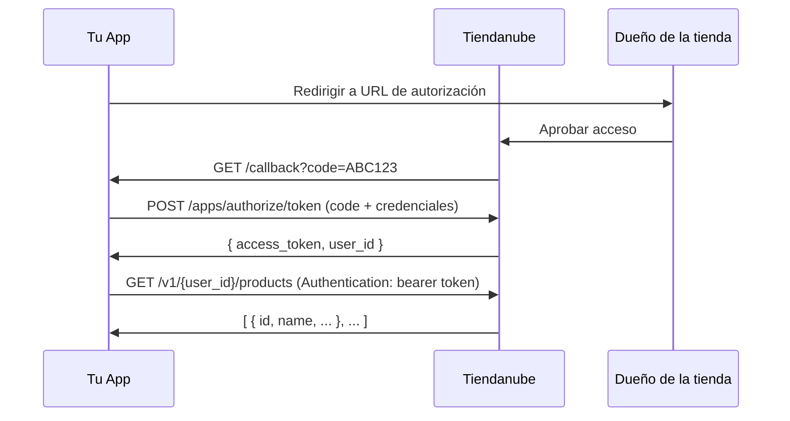

# Flujo OAuth de Tiendanube — Referencia técnica

Documentación técnica del flujo OAuth para integrar apps con la API de Tiendanube.

---

## Diagrama del flujo



---

## Diferencias clave entre los tres identificadores

| Identificador | Qué es | Cuándo lo obtenés | Expira |
|---------------|--------|-------------------|--------|
| `client_id` | Identifica tu app en Tiendanube | Al registrar la app en el portal | Nunca |
| `code` | Código de autorización temporal | Después de que el dueño aprueba | En minutos (uso único) |
| `access_token` | Token de acceso a la API de una tienda | Al intercambiar el code | Nunca (salvo desinstalación) |

---

## Notas específicas de Tiendanube

### Header de autenticación
La API de Tiendanube usa `Authentication` (sin `z`), no el estándar `Authorization`:

```
Authentication: bearer TU_ACCESS_TOKEN
```

Este es el error más común en implementaciones nuevas.

### User-Agent requerido
Todos los requests a la API deben incluir un `User-Agent`:

```
User-Agent: NombreDeTuApp/1.0 (contacto@tuapp.com)
```

### Tokens permanentes
Los `access_token` de Tiendanube no expiran por tiempo. Se invalidan solo si:
- El dueño de la tienda desinstala tu app
- Tu app emite un nuevo token para la misma tienda

### URL de token
```
POST https://www.tiendanube.com/apps/authorize/token
```

No es la misma URL que la de autorización del usuario.

---

## Endpoints de inicio del flujo

| Step | Método | URL |
|------|--------|-----|
| Autorización | GET | `https://www.tiendanube.com/apps/{client_id}/authorize` |
| Token | POST | `https://www.tiendanube.com/apps/authorize/token` |
| API base | — | `https://api.tiendanube.com/v1/{store_id}/` |

---

## Recursos

- [Documentación oficial de la API](https://tiendanube.github.io/api-documentation/)
- [Portal de partners](https://partners.tiendanube.com)
