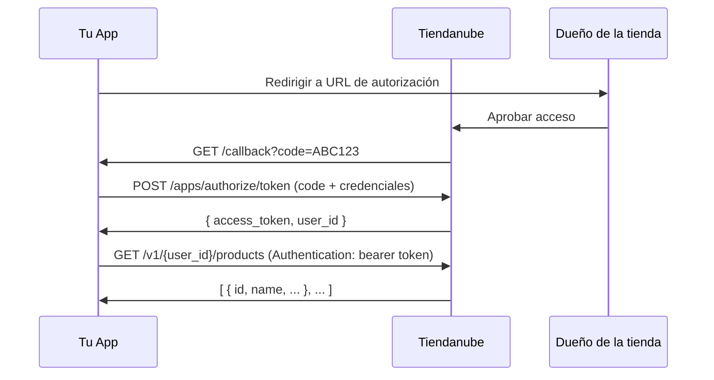

# OAuthFlow Implementation Plan

> **For agentic workers:** REQUIRED SUB-SKILL: Use superpowers:subagent-driven-development (recommended) or superpowers:executing-plans to implement this plan task-by-task. Steps use checkbox (`- [ ]`) syntax for tracking.

**Goal:** Construir una página web estática que explica el flujo OAuth de Tiendanube en 5 pasos, con código visible, errores frecuentes documentados, y paleta Nimbus real.

**Architecture:** Página HTML/CSS/JS pura sin backend ni build tools. El contenido de los pasos vive en `data/steps.js` como objetos JS; `app.js` los renderiza en el DOM al cargar. Prism.js (CDN) hace el syntax highlighting del código.

**Tech Stack:** HTML5, CSS3 (custom properties), Vanilla JS ES6+, Prism.js CDN

---

## Mapa de archivos

| Archivo | Responsabilidad |
|---------|----------------|
| `index.html` | Estructura HTML completa; contenedores para pasos y errores |
| `css/style.css` | Tokens Nimbus como variables CSS; todos los estilos de componentes |
| `data/steps.js` | Objetos JS con el contenido de los 5 pasos y 4 errores |
| `js/app.js` | Render de cards desde data, timeline interactivo, copy buttons |
| `docs/oauth-flow.md` | Documentación técnica con diagrama Mermaid |
| `README.md` | Descripción del proyecto, setup, disclaimer |

---

## Task 1: Scaffolding — estructura de carpetas y limpieza

**Files:**
- Modify: `.gitignore`
- Remove: `.env.example` (era del proyecto anterior)
- Create dirs: `css/`, `js/`, `data/`, `docs/`

- [ ] **Crear las carpetas del proyecto**

```bash
mkdir -p css js data docs
```

- [ ] **Eliminar el .env.example del proyecto anterior**

```bash
rm .env.example
```

- [ ] **Verificar la estructura**

```bash
find . -not -path './.git/*' -not -path './.claude/*' -not -path './docs/superpowers/*' -not -name '.DS_Store' | sort
```

Salida esperada:
```
.
./.gitignore
./css
./data
./docs
./js
```

- [ ] **Commit**

```bash
git add -A
git commit -m "chore: scaffold project structure for OAuthFlow"
```

---

## Task 2: css/style.css — tokens Nimbus y estilos base

**Files:**
- Create: `css/style.css`

- [ ] **Crear css/style.css con los tokens Nimbus y el reset base**

```css
/* ─── Tokens Nimbus ──────────────────────────────────────── */
:root {
  /* Primary */
  --color-primary:          #0059d5;
  --color-primary-hover:    #00429f;
  --color-primary-surface:  #eef5ff;
  --color-primary-highlight:#96c1fc;

  /* Success */
  --color-success:          #00c87b;
  --color-success-surface:  #defef2;
  --color-success-text:     #007447;

  /* Neutral */
  --color-bg:               #f6f6f6;
  --color-card:             #ffffff;
  --color-border:           #e7e7e7;
  --color-border-strong:    #d1d1d1;
  --color-text-high:        #0a0a0a;
  --color-text-low:         #5d5d5d;
  --color-text-muted:       #888888;
  --color-text-disabled:    #b0b0b0;

  /* Danger */
  --color-danger-surface:   #fedede;
  --color-danger-text:      #c80003;

  /* Warning */
  --color-warning-surface:  #fef2de;
  --color-warning-text:     #c87b00;

  /* Code */
  --color-code-bg:          #0a0a0a;
  --color-code-var:         #96c1fc;
  --color-code-string:      #7af7c7;
  --color-code-comment:     #6d6d6d;

  /* Spacing */
  --radius-sm:  6px;
  --radius-md:  10px;
  --radius-lg:  16px;
  --shadow-sm:  0 1px 4px rgba(0, 0, 0, 0.07);
  --shadow-md:  0 2px 8px rgba(0, 89, 213, 0.10);
}

/* ─── Reset base ─────────────────────────────────────────── */
*, *::before, *::after {
  box-sizing: border-box;
  margin: 0;
  padding: 0;
}

body {
  font-family: -apple-system, BlinkMacSystemFont, 'Segoe UI', Roboto, sans-serif;
  background: var(--color-bg);
  color: var(--color-text-high);
  line-height: 1.6;
  font-size: 16px;
}

a {
  color: var(--color-primary);
  text-decoration: none;
}

a:hover {
  color: var(--color-primary-hover);
  text-decoration: underline;
}

code {
  font-family: 'SF Mono', Consolas, 'Liberation Mono', monospace;
  font-size: 0.875em;
  background: var(--color-primary-surface);
  color: var(--color-primary);
  padding: 2px 6px;
  border-radius: 4px;
}
```

- [ ] **Verificar que no hay errores de sintaxis abriendo index.html en el navegador** (todavía no existe — se verifica en Task 5)

- [ ] **Commit**

```bash
git add css/style.css
git commit -m "feat: add Nimbus CSS tokens and base reset"
```

---

## Task 3: css/style.css — todos los componentes

**Files:**
- Modify: `css/style.css` (agregar al final del archivo)

- [ ] **Agregar estilos del header al final de css/style.css**

```css
/* ─── Header ─────────────────────────────────────────────── */
.site-header {
  background: var(--color-card);
  border-bottom: 1px solid var(--color-border);
  padding: 12px 24px;
  display: flex;
  align-items: center;
  justify-content: space-between;
  position: sticky;
  top: 0;
  z-index: 100;
}

.header-logo {
  display: flex;
  align-items: center;
  gap: 10px;
}

.header-logo-icon {
  width: 28px;
  height: 28px;
  background: var(--color-primary);
  border-radius: 6px;
  display: flex;
  align-items: center;
  justify-content: center;
  flex-shrink: 0;
}

.header-logo-icon svg {
  width: 14px;
  height: 14px;
  fill: #fff;
}

.header-logo-name {
  font-size: 1rem;
  font-weight: 700;
  color: var(--color-text-high);
}

.header-badge {
  font-size: 0.75rem;
  color: var(--color-text-low);
  background: var(--color-bg);
  padding: 2px 10px;
  border-radius: 12px;
  border: 1px solid var(--color-border);
}

.header-nav {
  display: flex;
  align-items: center;
  gap: 16px;
  font-size: 0.875rem;
}

.header-nav a {
  color: var(--color-text-low);
}

.btn-primary {
  background: var(--color-primary);
  color: #fff;
  padding: 6px 14px;
  border-radius: var(--radius-sm);
  font-size: 0.8125rem;
  font-weight: 600;
  transition: background 0.15s;
}

.btn-primary:hover {
  background: var(--color-primary-hover);
  color: #fff;
  text-decoration: none;
}
```

- [ ] **Agregar estilos del hero y timeline**

```css
/* ─── Hero ───────────────────────────────────────────────── */
.hero {
  background: var(--color-primary-surface);
  padding: 40px 24px;
  text-align: center;
  border-bottom: 1px solid var(--color-border-strong);
}

.hero-eyebrow {
  display: inline-block;
  background: var(--color-primary);
  color: #fff;
  font-size: 0.6875rem;
  font-weight: 700;
  padding: 3px 12px;
  border-radius: 12px;
  margin-bottom: 14px;
  letter-spacing: 0.5px;
  text-transform: uppercase;
}

.hero h1 {
  font-size: 2rem;
  font-weight: 800;
  color: var(--color-text-high);
  line-height: 1.2;
  margin-bottom: 10px;
}

.hero-subtitle {
  font-size: 0.9375rem;
  color: var(--color-text-low);
  max-width: 440px;
  margin: 0 auto 28px;
  line-height: 1.6;
}

/* ─── Timeline ───────────────────────────────────────────── */
.timeline-card {
  display: inline-flex;
  align-items: flex-start;
  gap: 0;
  background: var(--color-card);
  border-radius: var(--radius-lg);
  padding: 20px 28px;
  box-shadow: var(--shadow-md);
  border: 1px solid var(--color-border);
  flex-wrap: wrap;
  justify-content: center;
}

.timeline-item {
  display: flex;
  flex-direction: column;
  align-items: center;
  gap: 6px;
  cursor: pointer;
}

.timeline-item:hover .timeline-circle {
  opacity: 0.85;
}

.timeline-circle {
  width: 36px;
  height: 36px;
  border-radius: 50%;
  display: flex;
  align-items: center;
  justify-content: center;
  font-size: 0.875rem;
  font-weight: 700;
  transition: transform 0.15s;
}

.timeline-circle:hover {
  transform: scale(1.08);
}

.timeline-circle.active {
  background: var(--color-primary);
  color: #fff;
  box-shadow: 0 2px 8px rgba(0, 89, 213, 0.30);
}

.timeline-circle.pending {
  background: var(--color-bg);
  color: var(--color-text-muted);
  border: 2px solid var(--color-border-strong);
}

.timeline-label {
  font-size: 0.6875rem;
  font-weight: 600;
  white-space: nowrap;
}

.timeline-label.active {
  color: var(--color-text-high);
}

.timeline-label.pending {
  color: var(--color-text-muted);
}

.timeline-connector {
  width: 48px;
  height: 2px;
  border-radius: 2px;
  margin-top: 17px;
  flex-shrink: 0;
}

.timeline-connector.active {
  background: var(--color-primary);
}

.timeline-connector.pending {
  background: var(--color-border);
}

.hero-hint {
  font-size: 0.8125rem;
  color: var(--color-text-muted);
  margin-top: 14px;
}
```

- [ ] **Agregar estilos del banner de contexto, steps y contenido principal**

```css
/* ─── Layout principal ───────────────────────────────────── */
.main-content {
  max-width: 860px;
  margin: 0 auto;
  padding: 0 16px 40px;
}

/* ─── Banner ─────────────────────────────────────────────── */
.context-banner {
  background: var(--color-card);
  border: 1px solid var(--color-border);
  border-radius: var(--radius-md);
  padding: 12px 18px;
  margin: 20px 0;
  font-size: 0.875rem;
  color: var(--color-text-low);
}

.context-banner a {
  color: var(--color-primary);
  font-weight: 600;
}

/* ─── Step Card ──────────────────────────────────────────── */
.step-card {
  background: var(--color-card);
  border-radius: var(--radius-md);
  box-shadow: var(--shadow-sm);
  border: 1px solid var(--color-border);
  margin-bottom: 12px;
  overflow: hidden;
}

.step-card-header {
  display: flex;
  align-items: center;
  gap: 14px;
  padding: 16px 20px;
  border-bottom: 2px solid var(--color-primary);
}

.step-number {
  width: 32px;
  height: 32px;
  border-radius: 50%;
  background: var(--color-primary);
  color: #fff;
  display: flex;
  align-items: center;
  justify-content: center;
  font-size: 0.875rem;
  font-weight: 700;
  flex-shrink: 0;
}

.step-header-text {
  flex: 1;
}

.step-title {
  font-size: 1rem;
  font-weight: 700;
  color: var(--color-text-high);
  margin-bottom: 2px;
}

.step-subtitle {
  font-size: 0.8125rem;
  color: var(--color-text-muted);
}

.step-badge {
  font-size: 0.6875rem;
  font-weight: 700;
  padding: 4px 10px;
  border-radius: 12px;
  white-space: nowrap;
  background: var(--color-success-surface);
  color: var(--color-success-text);
}

.step-body {
  padding: 18px 20px;
  display: flex;
  flex-direction: column;
  gap: 14px;
}

.step-description {
  font-size: 0.9375rem;
  color: var(--color-text-low);
  line-height: 1.7;
}

/* ─── Code Block ─────────────────────────────────────────── */
.code-block {
  border: 1px solid var(--color-border);
  border-radius: var(--radius-sm);
  overflow: hidden;
}

.code-block-header {
  background: var(--color-bg);
  padding: 7px 14px;
  font-size: 0.75rem;
  font-weight: 600;
  color: var(--color-text-low);
  display: flex;
  justify-content: space-between;
  align-items: center;
  border-bottom: 1px solid var(--color-border);
}

.copy-btn {
  background: none;
  border: none;
  color: var(--color-primary);
  font-size: 0.75rem;
  font-weight: 600;
  cursor: pointer;
  padding: 0;
  font-family: inherit;
}

.copy-btn:hover {
  color: var(--color-primary-hover);
}

.copy-btn.copied {
  color: var(--color-success-text);
}

/* Override Prism theme for code blocks */
.code-block pre[class*="language-"] {
  margin: 0;
  border-radius: 0;
  background: var(--color-code-bg) !important;
  padding: 14px;
  font-size: 0.8125rem;
  line-height: 1.8;
  overflow-x: auto;
}

.code-block code[class*="language-"] {
  background: none;
  padding: 0;
  font-size: inherit;
  color: #e7e7e7;
  border-radius: 0;
}

/* Custom Prism token overrides */
.token.comment   { color: var(--color-code-comment); }
.token.string    { color: var(--color-code-string); }
.token.variable,
.token.attr-name { color: var(--color-code-var); }
.token.keyword   { color: #c792ea; }
.token.function  { color: #82aaff; }
.token.number    { color: #f78c6c; }
.token.operator  { color: #89ddff; }
.token.punctuation { color: #89ddff; }
.token.property  { color: var(--color-code-var); }

/* ─── Tip ────────────────────────────────────────────────── */
.tip {
  background: var(--color-success-surface);
  border-left: 3px solid var(--color-success);
  padding: 10px 14px;
  font-size: 0.875rem;
  color: var(--color-success-text);
  border-radius: 0 var(--radius-sm) var(--radius-sm) 0;
  line-height: 1.6;
}

.tip code {
  background: rgba(0, 200, 123, 0.15);
  color: var(--color-success-text);
  padding: 1px 4px;
}

/* ─── Warning inline ─────────────────────────────────────── */
.warning-inline {
  background: var(--color-warning-surface);
  border-left: 3px solid var(--color-warning-text);
  padding: 10px 14px;
  font-size: 0.875rem;
  color: var(--color-warning-text);
  border-radius: 0 var(--radius-sm) var(--radius-sm) 0;
  line-height: 1.6;
}

.warning-inline code {
  background: rgba(200, 123, 0, 0.12);
  color: var(--color-warning-text);
  padding: 1px 4px;
}
```

- [ ] **Agregar estilos de la sección de errores y el footer**

```css
/* ─── Errors section ─────────────────────────────────────── */
.errors-section {
  background: var(--color-card);
  border-radius: var(--radius-md);
  box-shadow: var(--shadow-sm);
  border: 1px solid var(--color-border);
  overflow: hidden;
  margin-bottom: 12px;
}

.errors-header {
  padding: 16px 20px;
  border-bottom: 1px solid var(--color-border);
  font-size: 1rem;
  font-weight: 700;
  color: var(--color-text-high);
}

.errors-grid {
  display: grid;
  grid-template-columns: repeat(4, 1fr);
  gap: 12px;
  padding: 16px 20px;
}

.error-card {
  border-radius: var(--radius-sm);
  padding: 12px;
}

.error-card.danger {
  background: var(--color-danger-surface);
  border: 1px solid #f77a7c;
}

.error-card.warning {
  background: var(--color-warning-surface);
  border: 1px solid #f7c77a;
}

.error-code {
  font-size: 0.8125rem;
  font-weight: 700;
  margin-bottom: 6px;
}

.error-card.danger .error-code { color: var(--color-danger-text); }
.error-card.warning .error-code { color: var(--color-warning-text); }

.error-cause,
.error-solution {
  font-size: 0.8125rem;
  line-height: 1.5;
  color: var(--color-text-low);
  margin-bottom: 4px;
}

.error-cause { color: var(--color-text-low); }

.error-solution {
  margin-top: 6px;
  padding-top: 6px;
  border-top: 1px solid rgba(0,0,0,0.06);
}

.error-card.danger .error-solution { color: #530001; }
.error-card.warning .error-solution { color: #533300; }

.error-card code {
  background: rgba(0,0,0,0.07);
  padding: 1px 4px;
  border-radius: 3px;
}

/* ─── Footer ─────────────────────────────────────────────── */
.site-footer {
  background: var(--color-text-high);
  color: var(--color-text-muted);
  padding: 18px 28px;
  display: flex;
  justify-content: space-between;
  align-items: center;
  font-size: 0.8125rem;
  flex-wrap: wrap;
  gap: 10px;
}

.footer-links {
  display: flex;
  gap: 18px;
}

.footer-links a {
  color: var(--color-text-muted);
  font-size: 0.8125rem;
}

.footer-links a.primary-link {
  color: var(--color-primary-highlight);
  font-weight: 600;
}

/* ─── Responsive ─────────────────────────────────────────── */
@media (max-width: 768px) {
  .hero h1 { font-size: 1.5rem; }
  .timeline-card { padding: 14px 10px; gap: 0; }
  .timeline-connector { width: 20px; }
  .errors-grid { grid-template-columns: repeat(2, 1fr); }
  .site-footer { flex-direction: column; align-items: flex-start; }
}

@media (max-width: 480px) {
  .errors-grid { grid-template-columns: 1fr; }
  .header-badge { display: none; }
  .timeline-label { font-size: 0.5625rem; }
}
```

- [ ] **Commit**

```bash
git add css/style.css
git commit -m "feat: add all component styles with Nimbus tokens"
```

---

## Task 4: data/steps.js — contenido de los 5 pasos y 4 errores

**Files:**
- Create: `data/steps.js`

- [ ] **Crear data/steps.js con el contenido completo**

```javascript
const STEPS = [
  {
    id: 1,
    title: "Registrar tu app en el portal de partners",
    subtitle: "Primer paso obligatorio antes de cualquier implementación",
    description:
      "Antes de implementar el flujo OAuth necesitás registrar tu aplicación en el portal de partners de Tiendanube. Esto te da el <code>client_id</code> y el <code>client_secret</code> que vas a usar en todos los pasos siguientes. El proceso toma menos de 5 minutos.",
    codeLabel: "Variables de entorno (.env)",
    codeLang: "bash",
    code: `# Obtenés estos datos del portal de partners
TIENDANUBE_CLIENT_ID="12345"
TIENDANUBE_CLIENT_SECRET="abc123xyz"
TIENDANUBE_REDIRECT_URI="https://tu-app.com/auth/callback"`,
    tip: "El <code>client_secret</code> nunca debe ir en código frontend ni en un repositorio público. Guardalo como variable de entorno en tu servidor.",
  },
  {
    id: 2,
    title: "Generar la URL de autorización",
    subtitle: "Redirigir al dueño de la tienda para que apruebe el acceso",
    description:
      "Tu app construye una URL especial y redirige al dueño de la tienda a esa dirección. Tiendanube le muestra una pantalla de aprobación donde puede aceptar o rechazar el acceso. Si aprueba, Tiendanube redirige de vuelta a tu <code>redirect_uri</code> con un código temporal.",
    codeLabel: "Node.js — construir la URL de autorización",
    codeLang: "javascript",
    code: `const clientId = process.env.TIENDANUBE_CLIENT_ID;
const redirectUri = process.env.TIENDANUBE_REDIRECT_URI;

const authUrl = new URL(\`https://www.tiendanube.com/apps/\${clientId}/authorize\`);
authUrl.searchParams.set('response_type', 'code');
authUrl.searchParams.set('client_id', clientId);
authUrl.searchParams.set('redirect_uri', redirectUri);

// Redirigir al dueño de la tienda
res.redirect(authUrl.toString());`,
    tip: "La <code>redirect_uri</code> debe coincidir exactamente con la que registraste en el portal de partners, incluyendo protocolo (<code>http</code> vs <code>https</code>) y cualquier barra al final.",
  },
  {
    id: 3,
    title: "Recibir el callback",
    subtitle: "Tiendanube redirige de vuelta a tu app con un código temporal",
    description:
      "Si el dueño de la tienda aprobó el acceso, Tiendanube hace un GET a tu <code>redirect_uri</code> con un parámetro <code>code</code> en la URL. Ese código es temporal y de un solo uso. Tu servidor lo recibe y lo usa en el siguiente paso para obtener el token definitivo.",
    codeLabel: "Node.js — recibir el callback (Express)",
    codeLang: "javascript",
    code: `app.get('/auth/callback', (req, res) => {
  const { code } = req.query;

  if (!code) {
    return res.status(400).send('Acceso denegado o error en la autorización.');
  }

  // El code expira en minutos — intercambialo de inmediato
  exchangeCodeForToken(code);
});`,
    tip: "El <code>code</code> es de un solo uso y expira en pocos minutos. Intercambialo por un token inmediatamente — no lo guardes ni lo reutilices.",
  },
  {
    id: 4,
    title: "Intercambiar el código por un token",
    subtitle: "POST a Tiendanube para obtener el access token definitivo",
    description:
      "Tu servidor hace un POST a Tiendanube enviando el <code>code</code> junto con tus credenciales de app. Tiendanube valida todo y responde con un <code>access_token</code> y el <code>user_id</code> de la tienda (que se usa como <code>store_id</code> en los llamados a la API). Este token no expira salvo que la app se desinstale.",
    codeLabel: "Node.js — intercambiar el código por token",
    codeLang: "javascript",
    code: `async function exchangeCodeForToken(code) {
  const response = await fetch('https://www.tiendanube.com/apps/authorize/token', {
    method: 'POST',
    headers: { 'Content-Type': 'application/json' },
    body: JSON.stringify({
      client_id:     process.env.TIENDANUBE_CLIENT_ID,
      client_secret: process.env.TIENDANUBE_CLIENT_SECRET,
      grant_type:    'authorization_code',
      code:          code,
    }),
  });

  const data = await response.json();
  // data.access_token → el token para llamar a la API
  // data.user_id      → el store_id de la tienda
  return data;
}`,
    tip: "Guardá el <code>access_token</code> y el <code>user_id</code> de forma segura. El token no expira hasta que la app sea desinstalada o se emita uno nuevo.",
  },
  {
    id: 5,
    title: "Usar el token para llamar a la API",
    subtitle: "Tu app ya tiene acceso autorizado a los datos de la tienda",
    description:
      "Con el <code>access_token</code> y el <code>user_id</code> ya podés llamar a cualquier endpoint de la API de Tiendanube. Incluí el token en el header <code>Authentication</code> y agregá un <code>User-Agent</code> identificando tu app — ambos son requeridos por la API.",
    codeLabel: "Node.js — llamar a la API con el token",
    codeLang: "javascript",
    code: `async function getProducts(storeId, accessToken) {
  const response = await fetch(
    \`https://api.tiendanube.com/v1/\${storeId}/products\`,
    {
      headers: {
        'Authentication': \`bearer \${accessToken}\`,
        'User-Agent':     'MiApp/1.0 (contacto@miapp.com)',
      },
    }
  );
  return response.json();
}`,
    warning:
      "El header se llama <code>Authentication</code>, no <code>Authorization</code>. Es un detalle específico de Tiendanube que genera muchos errores 401 en la implementación inicial.",
    tip: "El <code>User-Agent</code> es requerido. Usá el nombre de tu app y un email de contacto — Tiendanube lo usa para identificar el origen de los requests.",
  },
];

const ERRORS = [
  {
    code: "401 Unauthorized",
    type: "danger",
    cause: "Token inválido, ausente, o header mal formado.",
    solution:
      "Verificá que el header sea <code>Authentication: bearer TU_TOKEN</code>. El nombre es <code>Authentication</code>, no <code>Authorization</code>.",
  },
  {
    code: "redirect_uri mismatch",
    type: "warning",
    cause: "La URL de callback no coincide con la registrada en el portal.",
    solution:
      "Deben ser idénticas: mismo protocolo, dominio, puerto y barra final. Sin diferencias.",
  },
  {
    code: "invalid_grant",
    type: "warning",
    cause: "El <code>code</code> de autorización ya fue usado o expiró.",
    solution:
      "Reiniciá el flujo OAuth desde el principio. Cada <code>code</code> funciona una sola vez.",
  },
  {
    code: "invalid_client",
    type: "warning",
    cause: "<code>client_id</code> o <code>client_secret</code> incorrectos.",
    solution:
      "Verificá tus credenciales en el portal de partners. Revisá que no haya espacios extra en las variables de entorno.",
  },
];
```

- [ ] **Commit**

```bash
git add data/steps.js
git commit -m "feat: add step and error content data"
```

---

## Task 5: index.html — estructura HTML completa

**Files:**
- Create: `index.html`

- [ ] **Crear index.html con toda la estructura**

```html
<!DOCTYPE html>
<html lang="es">
<head>
  <meta charset="UTF-8" />
  <meta name="viewport" content="width=device-width, initial-scale=1.0" />
  <title>OAuthFlow — Guía interactiva de OAuth para Tiendanube</title>
  <meta name="description" content="Guía paso a paso para implementar OAuth en Tiendanube. Para partners y agencias." />
  <link rel="stylesheet" href="css/style.css" />
  <!-- Prism.js syntax highlighting -->
  <link rel="stylesheet" href="https://cdnjs.cloudflare.com/ajax/libs/prism/1.29.0/themes/prism-tomorrow.min.css" />
</head>
<body>

  <!-- HEADER -->
  <header class="site-header">
    <div class="header-logo">
      <div class="header-logo-icon">
        <svg viewBox="0 0 24 24" xmlns="http://www.w3.org/2000/svg">
          <path d="M12 2C8.13 2 5 5.13 5 9c0 2.38 1.19 4.47 3 5.74V17c0 .55.45 1 1 1h6c.55 0 1-.45 1-1v-2.26C17.81 13.47 19 11.38 19 9c0-3.87-3.13-7-7-7zm-1 14v-1h2v1h-2zm3-3.1V15h-4v-2.1C8.48 12.07 7 10.67 7 9c0-2.76 2.24-5 5-5s5 2.24 5 5c0 1.67-1.48 3.07-3 3.9z"/>
        </svg>
      </div>
      <span class="header-logo-name">OAuthFlow</span>
      <span class="header-badge">Guía para partners</span>
    </div>
    <nav class="header-nav">
      <a href="https://tiendanube.github.io/api-documentation/" target="_blank" rel="noopener">Docs API</a>
      <a href="https://github.com" target="_blank" rel="noopener" class="btn-primary">GitHub ↗</a>
    </nav>
  </header>

  <!-- HERO -->
  <section class="hero">
    <span class="hero-eyebrow">Guía técnica · Partners Tiendanube</span>
    <h1>¿Cómo funciona OAuth<br>en Tiendanube?</h1>
    <p class="hero-subtitle">Guía paso a paso para que tu app pueda acceder a los datos de una tienda con autorización del dueño.</p>

    <!-- TIMELINE -->
    <div class="timeline-card" id="timeline" role="navigation" aria-label="Pasos del flujo OAuth">
      <!-- Renderizado por app.js -->
    </div>
    <p class="hero-hint">Hacé click en un paso para ir directo a esa sección ↓</p>
  </section>

  <!-- CONTENIDO PRINCIPAL -->
  <main class="main-content">

    <!-- Banner de contexto -->
    <p class="context-banner">
      Esta guía es una <strong>demo educativa</strong>. No reemplaza la
      <a href="https://tiendanube.github.io/api-documentation/" target="_blank" rel="noopener">documentación oficial de Tiendanube</a>.
      Los ejemplos usan Node.js, pero el flujo aplica a cualquier lenguaje.
    </p>

    <!-- Cards de los 5 pasos -->
    <div id="steps-container">
      <!-- Renderizado por app.js -->
    </div>

    <!-- Errores frecuentes -->
    <section class="errors-section" id="errores">
      <h2 class="errors-header">Errores frecuentes y cómo resolverlos</h2>
      <div class="errors-grid" id="errors-container">
        <!-- Renderizado por app.js -->
      </div>
    </section>

  </main>

  <!-- FOOTER -->
  <footer class="site-footer">
    <span>OAuthFlow · Demo educativa · No es un producto oficial de Tiendanube</span>
    <nav class="footer-links">
      <a href="https://tiendanube.github.io/api-documentation/" target="_blank" rel="noopener" class="primary-link">Docs oficiales TN ↗</a>
      <a href="https://github.com" target="_blank" rel="noopener">GitHub</a>
    </nav>
  </footer>

  <!-- Scripts -->
  <script src="data/steps.js"></script>
  <script src="https://cdnjs.cloudflare.com/ajax/libs/prism/1.29.0/components/prism-core.min.js"></script>
  <script src="https://cdnjs.cloudflare.com/ajax/libs/prism/1.29.0/plugins/autoloader/prism-autoloader.min.js"></script>
  <script src="js/app.js"></script>

</body>
</html>
```

- [ ] **Abrir index.html en el navegador y verificar que se ve el header y el hero** (las cards todavía no porque falta app.js)

```bash
open index.html
```

Verificar: header con logo, hero con título, banner. Las secciones de pasos y errores están vacías — es correcto.

- [ ] **Commit**

```bash
git add index.html
git commit -m "feat: add HTML structure with header, hero, and content containers"
```

---

## Task 6: js/app.js — render, timeline interactivo y copy buttons

**Files:**
- Create: `js/app.js`

- [ ] **Crear js/app.js con todas las funciones**

```javascript
// ─── Helpers ──────────────────────────────────────────────

function escapeHtml(str) {
  return str
    .replace(/&/g, '&amp;')
    .replace(/</g, '&lt;')
    .replace(/>/g, '&gt;');
}

// ─── Render step card ──────────────────────────────────────

function renderStep(step) {
  const warningHtml = step.warning
    ? `<div class="warning-inline">${step.warning}</div>`
    : '';

  return `
    <article class="step-card" id="paso-${step.id}">
      <div class="step-card-header">
        <div class="step-number">${step.id}</div>
        <div class="step-header-text">
          <div class="step-title">${step.title}</div>
          <div class="step-subtitle">${step.subtitle}</div>
        </div>
        <span class="step-badge" id="badge-${step.id}" style="display:none;">✓ Completado</span>
      </div>
      <div class="step-body">
        <p class="step-description">${step.description}</p>
        <div class="code-block">
          <div class="code-block-header">
            <span>${step.codeLabel}</span>
            <button class="copy-btn" data-step="${step.id}">Copiar</button>
          </div>
          <pre><code class="language-${step.codeLang}">${escapeHtml(step.code)}</code></pre>
        </div>
        ${warningHtml}
        <div class="tip">${step.tip}</div>
      </div>
    </article>
  `;
}

// ─── Render error card ─────────────────────────────────────

function renderError(error) {
  return `
    <div class="error-card ${error.type}">
      <div class="error-code">${error.code}</div>
      <div class="error-cause">${error.cause}</div>
      <div class="error-solution">${error.solution}</div>
    </div>
  `;
}

// ─── Render timeline ───────────────────────────────────────

function renderTimeline() {
  const container = document.getElementById('timeline');
  if (!container) return;

  let html = '';
  STEPS.forEach((step, index) => {
    html += `
      <div class="timeline-item" data-step="${step.id}" role="button"
           tabindex="0" aria-label="Ir al paso ${step.id}: ${step.title}">
        <div class="timeline-circle pending" id="tc-${step.id}">${step.id}</div>
        <span class="timeline-label pending" id="tl-${step.id}">${step.title.split(' ')[0]}</span>
      </div>
    `;
    if (index < STEPS.length - 1) {
      html += `<div class="timeline-connector pending" id="conn-${step.id}"></div>`;
    }
  });

  container.innerHTML = html;
}

// ─── Timeline interactivity ────────────────────────────────

function activateStep(stepId) {
  STEPS.forEach((step) => {
    const circle = document.getElementById(`tc-${step.id}`);
    const label  = document.getElementById(`tl-${step.id}`);
    const conn   = document.getElementById(`conn-${step.id}`);
    const badge  = document.getElementById(`badge-${step.id}`);

    if (step.id <= stepId) {
      circle.className = 'timeline-circle active';
      label.className  = 'timeline-label active';
      if (conn) conn.className = 'timeline-connector active';
    } else {
      circle.className = 'timeline-circle pending';
      label.className  = 'timeline-label pending';
      if (conn) conn.className = 'timeline-connector pending';
    }

    if (badge) {
      badge.style.display = step.id < stepId ? 'inline-block' : 'none';
    }
  });
}

function initTimeline() {
  const items = document.querySelectorAll('.timeline-item');

  items.forEach((item) => {
    const handler = () => {
      const stepId = parseInt(item.dataset.step, 10);
      const target = document.getElementById(`paso-${stepId}`);
      if (target) {
        target.scrollIntoView({ behavior: 'smooth', block: 'start' });
        activateStep(stepId);
      }
    };

    item.addEventListener('click', handler);
    item.addEventListener('keydown', (e) => {
      if (e.key === 'Enter' || e.key === ' ') {
        e.preventDefault();
        handler();
      }
    });
  });
}

// Highlight active step on scroll via IntersectionObserver
function initScrollObserver() {
  const cards = document.querySelectorAll('.step-card');
  if (!cards.length || !('IntersectionObserver' in window)) return;

  const observer = new IntersectionObserver(
    (entries) => {
      entries.forEach((entry) => {
        if (entry.isIntersecting) {
          const stepId = parseInt(entry.target.id.replace('paso-', ''), 10);
          activateStep(stepId);
        }
      });
    },
    { threshold: 0.4 }
  );

  cards.forEach((card) => observer.observe(card));
}

// ─── Copy buttons ──────────────────────────────────────────

function initCopyButtons() {
  document.querySelectorAll('.copy-btn').forEach((btn) => {
    btn.addEventListener('click', async () => {
      const stepId = parseInt(btn.dataset.step, 10);
      const step   = STEPS.find((s) => s.id === stepId);
      if (!step) return;

      try {
        await navigator.clipboard.writeText(step.code);
        btn.textContent = '¡Copiado!';
        btn.classList.add('copied');
        setTimeout(() => {
          btn.textContent = 'Copiar';
          btn.classList.remove('copied');
        }, 2000);
      } catch {
        btn.textContent = 'Error al copiar';
        setTimeout(() => { btn.textContent = 'Copiar'; }, 2000);
      }
    });
  });
}

// ─── Init ──────────────────────────────────────────────────

function init() {
  // Render timeline
  renderTimeline();

  // Render step cards
  const stepsContainer = document.getElementById('steps-container');
  if (stepsContainer) {
    stepsContainer.innerHTML = STEPS.map(renderStep).join('');
  }

  // Render error cards
  const errorsContainer = document.getElementById('errors-container');
  if (errorsContainer) {
    errorsContainer.innerHTML = ERRORS.map(renderError).join('');
  }

  // Activate first step by default
  activateStep(1);

  // Wire up interactions
  initTimeline();
  initScrollObserver();
  initCopyButtons();

  // Trigger Prism highlighting on dynamically rendered code
  if (typeof Prism !== 'undefined') {
    Prism.highlightAll();
  }
}

document.addEventListener('DOMContentLoaded', init);
```

- [ ] **Abrir index.html en el navegador y verificar**

```bash
open index.html
```

Verificar punto por punto:
- [ ] Se ven los 5 pasos renderizados con título, texto, código y tip
- [ ] El código tiene syntax highlighting (colores)
- [ ] El timeline muestra el paso 1 activo (círculo azul) y 2-5 en gris
- [ ] Al hacer click en el número 3 del timeline: scrollea al paso 3 y activa los pasos 1, 2, 3 en azul
- [ ] El botón "Copiar" copia el código al portapapeles y cambia a "¡Copiado!"
- [ ] Al scrollear hasta el paso 4, el timeline muestra 1-4 en azul

- [ ] **Commit**

```bash
git add js/app.js
git commit -m "feat: add app.js with step rendering, timeline, and copy buttons"
```

---

## Task 7: Verificación visual completa

**Files:** ninguno — solo verificación

- [ ] **Abrir index.html y recorrer toda la página**

```bash
open index.html
```

Checklist de verificación:

**Header:**
- [ ] Logo azul + "OAuthFlow" + badge "Guía para partners"
- [ ] Link "Docs API" y botón "GitHub ↗" alineados a la derecha

**Hero:**
- [ ] Fondo `#eef5ff`, badge azul sólido
- [ ] Título grande, subtítulo en gris
- [ ] Timeline con 5 pasos, paso 1 en azul, 2-5 en gris

**Pasos:**
- [ ] 5 cards blancas sobre fondo gris claro
- [ ] Cada card tiene borde superior azul, número azul, título, subtítulo
- [ ] El código tiene syntax highlighting con fondo oscuro
- [ ] Botón "Copiar" funciona
- [ ] Tip verde visible en cada paso
- [ ] Paso 5 tiene aviso naranja de `Authentication` vs `Authorization`

**Errores:**
- [ ] 4 cards en fila: 1 roja (`401`) y 3 amarillas
- [ ] En mobile (DevTools): se ve en 2x2

**Footer:**
- [ ] Fondo negro, texto gris, link azul claro a docs de TN

**Responsive (DevTools → toggle device):**
- [ ] En 768px: errores en 2x2, timeline se comprime
- [ ] En 480px: errores en 1 columna, badge del header se oculta

- [ ] **No hay console errors en DevTools**

- [ ] **Commit si todo está ok**

```bash
git add -A
git commit -m "fix: visual verification pass — no changes needed" --allow-empty
```

(Si hubo ajustes, commitear los cambios en lugar del empty commit.)

---

## Task 8: docs/oauth-flow.md — documentación técnica

**Files:**
- Create: `docs/oauth-flow.md`

- [ ] **Crear docs/oauth-flow.md**

```markdown
# Flujo OAuth de Tiendanube — Referencia técnica

Documentación técnica del flujo OAuth para integrar apps con la API de Tiendanube.

---

## Diagrama del flujo



---

## Diferencias clave entre los tres identificadores

| Identificador | Qué es | Cuándo lo obtenés | Expira |
|---------------|--------|-------------------|--------|
| `client_id` | Identifica tu app en Tiendanube | Al registrar la app en el portal | Nunca |
| `code` | Código de autorización temporal | Después de que el dueño aprueba | En minutos (uso único) |
| `access_token` | Token de acceso a la API de una tienda | Al intercambiar el code | Nunca (salvo desinstalación) |

---

## Notas específicas de Tiendanube

### Header de autenticación
La API de Tiendanube usa `Authentication` (sin `z`), no el estándar `Authorization`:

```
Authentication: bearer TU_ACCESS_TOKEN
```

Este es el error más común en implementaciones nuevas.

### User-Agent requerido
Todos los requests a la API deben incluir un `User-Agent`:

```
User-Agent: NombreDeTuApp/1.0 (contacto@tuapp.com)
```

### Tokens permanentes
Los `access_token` de Tiendanube no expiran por tiempo. Se invalidan solo si:
- El dueño de la tienda desinstala tu app
- Tu app emite un nuevo token para la misma tienda

### URL de token
```
POST https://www.tiendanube.com/apps/authorize/token
```

No es la misma URL que la de autorización del usuario.

---

## Endpoints de inicio del flujo

| Step | Método | URL |
|------|--------|-----|
| Autorización | GET | `https://www.tiendanube.com/apps/{client_id}/authorize` |
| Token | POST | `https://www.tiendanube.com/apps/authorize/token` |
| API base | — | `https://api.tiendanube.com/v1/{store_id}/` |

---

## Recursos

- [Documentación oficial de la API](https://tiendanube.github.io/api-documentation/)
- [Portal de partners](https://partners.tiendanube.com)
```

- [ ] **Commit**

```bash
git add docs/oauth-flow.md
git commit -m "docs: add technical OAuth flow reference with Mermaid diagram"
```

---

## Task 9: README.md — descripción del proyecto

**Files:**
- Create: `README.md`

- [ ] **Crear README.md en la raíz**

```markdown
# OAuthFlow — Guía interactiva de OAuth para Tiendanube

Página web estática que explica el flujo OAuth de Tiendanube paso a paso, con ejemplos de código, errores frecuentes y paleta de colores del design system Nimbus.

> Demo educativa. No es un producto oficial de Tiendanube.

---

## ¿Qué cubre la guía?

1. **Registrar tu app** — portal de partners, client_id y client_secret
2. **Generar la URL de autorización** — redirigir al dueño de la tienda
3. **Recibir el callback** — extraer el code temporal
4. **Intercambiar el código por un token** — POST a Tiendanube
5. **Usar el token para llamar a la API** — headers correctos y primer request

Más una sección de **errores frecuentes**: 401, redirect_uri mismatch, invalid_grant, invalid_client.

---

## Cómo correrlo localmente

No requiere instalación. Abrí el archivo directo en el navegador:

```bash
git clone https://github.com/TU_USUARIO/tiendanube-oauth-flow.git
cd tiendanube-oauth-flow
open index.html        # macOS
# o
start index.html       # Windows
```

---

## Estructura del proyecto

```
├── index.html          # página principal
├── css/style.css       # tokens Nimbus + estilos de componentes
├── js/app.js           # render, timeline interactivo, copy buttons
├── data/steps.js       # contenido de los 5 pasos y 4 errores
└── docs/
    └── oauth-flow.md   # referencia técnica con diagrama Mermaid
```

---

## Tecnologías

- HTML5 / CSS3 / Vanilla JS (ES6+)
- [Prism.js](https://prismjs.com/) — syntax highlighting (CDN)
- [Nimbus Design System](https://nimbus.tiendanube.com) — paleta de colores oficial de Tiendanube

---

## Recursos oficiales

- [Documentación de la API de Tiendanube](https://tiendanube.github.io/api-documentation/)
- [Portal de partners](https://partners.tiendanube.com)
- [Nimbus Design System](https://nimbus.tiendanube.com)
```

- [ ] **Commit**

```bash
git add README.md
git commit -m "docs: add README with project description and setup instructions"
```

---

## Task 10: Deploy en GitHub Pages

**Files:** ninguno — configuración en GitHub

- [ ] **Crear el repositorio en GitHub** (si no existe)

```bash
gh repo create tiendanube-oauth-flow --public --description "Guía interactiva del flujo OAuth de Tiendanube para partners y agencias"
```

- [ ] **Pushear el código**

```bash
git remote add origin https://github.com/TU_USUARIO/tiendanube-oauth-flow.git
git push -u origin main
```

- [ ] **Activar GitHub Pages en la configuración del repo**

```bash
gh api repos/TU_USUARIO/tiendanube-oauth-flow/pages \
  --method POST \
  -f source.branch=main \
  -f source.path=/
```

- [ ] **Verificar que la página se publica** (puede tardar 1-2 minutos)

```bash
gh api repos/TU_USUARIO/tiendanube-oauth-flow/pages --jq '.html_url'
```

- [ ] **Abrir la URL y verificar que funciona igual que localmente**

La URL quedará en: `https://TU_USUARIO.github.io/tiendanube-oauth-flow`

- [ ] **Actualizar el link de GitHub en index.html con la URL real del repo**

En `index.html`, reemplazar las dos instancias de `https://github.com` con la URL real:

```html
<a href="https://github.com/TU_USUARIO/tiendanube-oauth-flow" target="_blank" rel="noopener" class="btn-primary">GitHub ↗</a>
```

y en el footer:

```html
<a href="https://github.com/TU_USUARIO/tiendanube-oauth-flow" target="_blank" rel="noopener">GitHub</a>
```

- [ ] **Commit y push final**

```bash
git add index.html
git commit -m "feat: add real GitHub repo links"
git push
```
```

---

## Self-Review

**Cobertura del spec:**
- [x] Header con logo, badge, links → Task 5
- [x] Hero con timeline horizontal → Task 5 + Task 6
- [x] Pasos completados/activos en azul, pendientes en gris → Task 6 (`activateStep`)
- [x] Click en timeline → smooth scroll → Task 6 (`initTimeline`)
- [x] Banner de contexto → Task 5
- [x] 5 step cards con título, subtítulo, texto, código, tip → Task 4 + 6
- [x] Paso 5 con warning naranja → Task 4 (`warning` field) + Task 6 (`renderStep`)
- [x] Badge "✓ Completado" para pasos anteriores → Task 6 (`activateStep`)
- [x] 4 error cards en fila/2x2 → Task 4 + 6 + Task 3 (grid responsive)
- [x] Footer → Task 5
- [x] Paleta Nimbus completa → Task 2 + 3
- [x] Prism.js syntax highlighting → Task 5 (CDN) + Task 6 (`Prism.highlightAll()`)
- [x] Copy buttons → Task 6 (`initCopyButtons`)
- [x] Responsive → Task 3 (media queries)
- [x] README → Task 9
- [x] docs/oauth-flow.md con Mermaid → Task 8
- [x] Deploy GitHub Pages → Task 10

**Placeholders:** ninguno encontrado.

**Consistencia de nombres:**
- `STEPS` / `ERRORS` definidos en Task 4, usados en Task 6 ✓
- `activateStep(stepId)` definido y llamado internamente en Task 6 ✓
- IDs del DOM: `paso-${id}`, `tc-${id}`, `tl-${id}`, `conn-${id}`, `badge-${id}` — consistentes entre Task 5 y Task 6 ✓
- `renderStep` / `renderError` — definidos y usados en `init()` ✓
